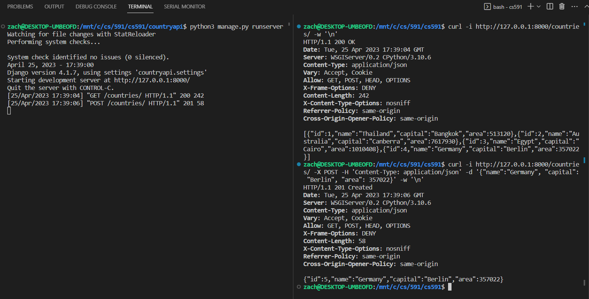
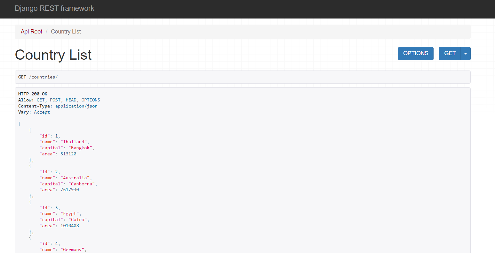

# cs591 Homework 5

A simple REST API server with Python and Django: see the [project documentation](HomeWork5.pdf) for more information. 

 

Below is a screenshot showing the REST API server working. 

 

Below is a screenshot showing the REST API server working through the web interface. 

 

This application is very simple and can be run from repo root using
> python3 h5/manage.py runserver

Some sample commands can be run using the following: 
- View the data of all countries: 
    > curl -i http://127.0.0.1:8000/countries/ -w '\n'
- Add a country with its details: 
    > curl -i http://127.0.0.1:8000/countries/ \
        -X POST \
        -H 'Content-Type: application/json' \
        -d '{"name":"Germany", "capital": "Berlin", "area": 357022}' \
        -w '\n'
- View the data of a specific country: 
    > curl -i http://127.0.0.1:8000/countries/1/ -w '\n'
